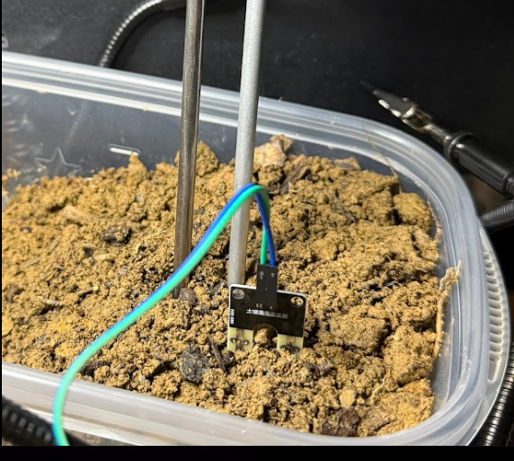
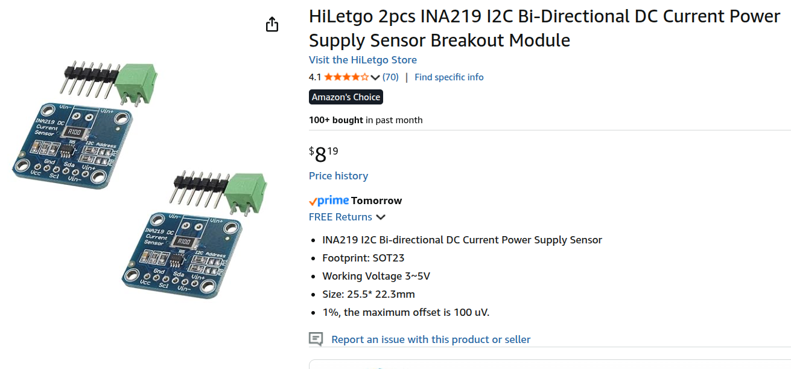

# ESP32 Hydrostatic Water Level Sensor with OLED Display

A complete water depth measurement system using an industrial 4-20 mA hydrostatic pressure sensor, INA219 current sensor module, LM393 soil moisture sensor, and Heltec WiFi LoRa 32 V3 board with built-in OLED display. This system accurately measures water depth in tanks and soil/rain moisture levels, displaying real-time readings in **inches/feet** on the OLED screen and via serial output.

## Overview

This project reads industrial 4-20 mA current loop signals from a hydrostatic pressure sensor and converts them to water depth measurements. Additionally, an LM393 soil moisture sensor provides moisture readings useful for rain detection and soil monitoring. The system uses an INA219 current sensor to measure the loop current, which is then processed by a Heltec WiFi LoRa 32 V3 board to calculate and display water depth in **inches** (or **feet + inches** for depths over 12") and percentage full. The built-in 0.96" OLED display provides real-time visual feedback, making the system ideal for standalone field deployment.

**Note**: The INA219 water level sensor is optional - if not connected, the system will continue to operate with moisture readings only.

### Key Features

- **Built-in OLED Display** - Heltec's 0.96" display shows real-time readings
- **Inches/Feet Display** - Shows depth as "8.5 in" or "1 ft 3.2 in" automatically
- **Soil Moisture Sensor** - LM393-based sensor for rain detection and soil moisture monitoring
- **4-20 mA current loop interface** for industrial sensor compatibility
- **High-precision INA219** current measurement (±0.8 mA resolution)
- **Optional INA219** - System continues with moisture-only mode if INA219 not connected
- **Noise-resistant averaging** of 10 samples per reading
- **Dual output format**: Depth in inches/feet and percentage full
- **Automatic fault detection** for sensor/wiring issues
- **Serial output** at 115200 baud for monitoring and data logging
- **Easy calibration** via single constant (tank depth in cm)
- **LoRa ready** - Board includes LoRa radio for future wireless features
- **Low memory footprint**: 343KB program (10% of 4MB flash), 22KB RAM

## Hardware Requirements

### Components

- **ALS-MPM-2F Hydrostatic Sensor** (4-20 mA output) - *optional*
- **Heltec WiFi LoRa 32 V3** (ESP32-S3 board with built-in OLED and LoRa)
- **INA219 Current Sensor Module** (I2C interface) - *optional, for water level*
- **LM393 Soil Moisture Sensor** (analog output, for rain/moisture detection)
- **19.5V Dell Power Supply** (barrel connector power brick) - *only needed for hydrostatic sensor*
- Connecting wires

### Why These Components?

- **Hydrostatic Sensor**: Measures water pressure which correlates directly to depth
- **4-20 mA Current Loop**: Industry standard for long-distance, noise-immune sensing
- **INA219**: Precision current sensor that measures the loop current
- **LM393 Soil Moisture Sensor**: Low-cost, reliable moisture detection for rain and soil monitoring
- **Heltec WiFi LoRa 32 V3**:
  - Built-in 0.96" OLED display (no external display needed!)
  - ESP32-S3 chip with WiFi and Bluetooth
  - Built-in LoRa radio (SX1262) for long-range wireless
  - 4MB flash memory
  - Compact all-in-one solution
- **Dell PSU**: Provides required voltage for 4-20 mA loop operation

### LM393 Soil Moisture Sensor



The **LM393** soil moisture sensor module is used for rain detection and soil moisture monitoring:

**What It Does:**
- **Measures Moisture**: Detects water/moisture levels via resistance change between two probes
- **Analog Output**: Provides variable voltage proportional to moisture (0-3.3V)
- **Digital Output**: Optional threshold-triggered output (adjustable via potentiometer)
- **Low Power**: Operates on 3.3V from the Heltec board

**Key Specifications:**
- Operating Voltage: 3.3V-5V (powered by ESP32's 3.3V)
- Output: Analog (AO) and Digital (DO)
- Potentiometer: Adjusts digital threshold sensitivity
- Size: Compact module with separate probe

**How It Works in This Project:**
1. The probe is inserted into soil or a rain collection container
2. Moisture between the probes changes the resistance
3. The LM393 comparator converts this to an analog voltage
4. The ESP32 reads the ADC value and converts to percentage (0-100%)
5. Higher moisture = lower ADC reading = higher percentage displayed

**Calibration:**
- Dry air reads ~4095 (0% moisture)
- Submerged in water reads ~1500 (100% moisture)
- Values can be adjusted in code via `MOISTURE_DRY_VALUE` and `MOISTURE_WET_VALUE` constants

### INA219 Current Sensor Module



The **INA219** is a high-precision I2C current and power sensor module that plays a critical role in this system:

**What It Does:**
- **Measures Current**: Precisely measures the 4-20 mA signal from the hydrostatic sensor
- **Bi-directional Sensing**: Can measure current flowing in either direction through its shunt resistor
- **High Accuracy**: ±0.8 mA precision, perfect for 4-20 mA industrial sensors
- **I2C Communication**: Sends measurements to the ESP32 via simple 2-wire I2C interface
- **Built-in ADC**: 12-bit analog-to-digital converter for accurate readings

**Key Specifications:**
- Operating Voltage: 3-5V (powered by ESP32's 3.3V)
- Measurement Range: Up to 26V, ±3.2A
- I2C Address: 0x40 (default)
- Size: 25.5mm × 22.3mm (compact)

**How It Works in This Project:**
1. The 4-20 mA current from the hydrostatic sensor flows through the INA219's shunt resistor
2. The INA219 measures the voltage drop across this resistor
3. It calculates the current and makes it available via I2C
4. The ESP32 reads this current value and converts it to water depth
5. Both serial output and OLED display show the results

The INA219 is the bridge between the industrial 4-20 mA sensor and the digital ESP32 microcontroller, making it essential for accurate water level monitoring.

## Wiring Diagram

```
=====================================================================
HYDROSTATIC SENSOR + INA219 + LM393 + HELTEC V3 + DELL 19.5V SUPPLY
=====================================================================

CURRENT LOOP (4-20 mA) - Optional for water level sensing
──────────────────────────────────────────────────────────
   DELL BRICK                    INA219 SHUNT                 HYDROSTATIC SENSOR
   -----------                -------------------             -------------------
                              |                 |
   White (+19.5 V) ---------->|  VIN+     VIN-  |------------> RED  (+V)
                              |                 |

   Black (GND) -------------------------------------------> BLACK (4–20 mA return)

   Blue (ID)  --> not used


          INA219 MODULE                   HELTEC WiFi LoRa 32 V3
          ==============                  =======================
          VCC   o--------------------->   3V3 (Header J3, Pin 2/3)
          GND   o---------------------.>  GND (Header J3, Pin 1)
                                       |
          SDA   o--------------------->|  GPIO 1  (Header J3, Pin 12)
          SCL   o--------------------->|  GPIO 2  (Header J3, Pin 13)
                                       |
   Dell BLACK (GND) -------------------'   (all grounds common)


LM393 SOIL MOISTURE SENSOR
──────────────────────────
          LM393 MODULE                    HELTEC WiFi LoRa 32 V3
          ==============                  =======================
          VCC   o--------------------->   3V3 (Header J3, Pin 2/3)
          GND   o--------------------->   GND (Header J3, Pin 1)
          AO    o--------------------->   GPIO 4  (Header J3, Pin 15)
          DO    o--------------------->   (not used - optional digital out)


   Built-in OLED: GPIO 17 (SDA), GPIO 18 (SCL) - Internal, not on headers
```

### Connection Summary

**LM393 Soil Moisture Sensor to Heltec V3:**
- VCC → 3V3 (Pin 2 or 3)
- GND → GND (Pin 1)
- AO → GPIO 4 (Pin 15) - Analog output
- DO → (not connected) - Optional digital threshold output

**INA219 to Heltec V3 (Header J3 - Left Side) - Optional:**
- VCC → 3V3 (Pin 2 or 3)
- GND → GND (Pin 1)
- SDA → GPIO 1 (Pin 12)
- SCL → GPIO 2 (Pin 13)

**Built-in OLED Display (Internal - No wiring needed!):**
- The Heltec V3 has a built-in 0.96" OLED
- Uses GPIO 17 (SDA) and GPIO 18 (SCL) internally
- No external OLED display required

**I2C Configuration:**
- **INA219**: Uses separate I2C bus (Wire1) on GPIO 1/2, address 0x40
- **Built-in OLED**: Uses main I2C bus (Wire) on GPIO 17/18, address 0x3C
- Two independent I2C buses - no conflicts

**Current Loop (Dell PSU → INA219 → Sensor) - Only if using hydrostatic sensor:**
- Dell White (+19.5V) → INA219 VIN+
- INA219 VIN- → Sensor RED wire (+V)
- Sensor BLACK wire → Dell Black (GND)
- All grounds must be common

## How It Works

### 4-20 mA Current Loop

Industrial sensors use current loops because:
- Current is immune to voltage drops over long cable runs
- Easy to detect broken wires (current drops to 0 mA)
- Industry standard for process control

The hydrostatic sensor outputs:
- **4 mA** when tank is empty (0% depth)
- **20 mA** when tank is full (100% depth)
- Linear scale in between (e.g., 12 mA = 50% full)

### Measurement Process

1. **Pressure Sensing**: Water depth creates pressure on the sensor
2. **Current Output**: Sensor converts pressure to 4-20 mA current
3. **Current Measurement**: INA219 measures the loop current
4. **I2C Communication**: ESP32 reads current value from INA219
5. **Averaging**: 10 samples averaged over 1 second for stability
6. **Conversion**: Linear interpolation converts mA to depth
7. **Display**: Results shown on OLED display and via serial output every 10 seconds

### Calculation Formula

```
Depth (cm) = ((Current - 4) / (20 - 4)) × MAX_DEPTH_CM
Percentage = ((Current - 4) / (20 - 4)) × 100
```

## Quick Start

### 1. Install Arduino Libraries

**Required Libraries:**
- Adafruit INA219 (for current sensor)
- Adafruit SSD1306 (for OLED display)
- Adafruit GFX Library (dependency, auto-installed)

Using Arduino IDE:
```
Sketch → Include Library → Manage Libraries
Search: "Adafruit INA219" → Install
Search: "Adafruit SSD1306" → Install
```

Or using arduino-cli:
```bash
arduino-cli lib install "Adafruit INA219"
arduino-cli lib install "Adafruit SSD1306"
```

### 2. Select Board Version

Edit `ESP32_HYDRO_STATIC.ino` lines 40-41 to match your Heltec board:
```cpp
// For V2 boards (older):
#define HELTEC_V2
// #define HELTEC_V3

// For V3 boards (newer - ESP32-S3):
// #define HELTEC_V2
#define HELTEC_V3
```

### 3. Configure Tank Depth

Edit `ESP32_HYDRO_STATIC.ino` - set your tank depth in centimeters:
```cpp
const float MAX_DEPTH_CM = 100.0;  // Change to your tank depth in cm
```
The display will automatically convert to inches/feet.

### 4. Upload Code

**Using Arduino IDE:**
- Board: **Heltec WiFi LoRa 32(V3)** (or V2 if using older board)
- Port: Select your Heltec port
- Click Upload
- Press PRG button on Heltec if upload fails

**Using arduino-cli (for V3):**
```bash
arduino-cli compile --fqbn esp32:esp32:heltec_wifi_lora_32_V3 .
arduino-cli upload --fqbn esp32:esp32:heltec_wifi_lora_32_V3 --port /dev/ttyUSB0 .
```

**Using arduino-cli (for V2):**
```bash
arduino-cli compile --fqbn esp32:esp32:heltec_wifi_lora_32_V2 .
arduino-cli upload --fqbn esp32:esp32:heltec_wifi_lora_32_V2 --port /dev/ttyUSB0 .
```

### 4. Monitor Output

Arduino IDE: Tools → Serial Monitor (115200 baud)

arduino-cli:
```bash
arduino-cli monitor -p /dev/ttyUSB0 -c baudrate=115200
```

### Expected Output

**Serial Monitor (115200 baud) - With INA219 Connected:**
```
Heltec WiFi LoRa 32 - Hydrostatic Water Level Sensor
====================================================
Board: Heltec WiFi LoRa 32 V3
I2C: OLED on GPIO17/18, INA219 on GPIO1/2
INA219 initialized successfully
Built-in OLED display initialized successfully
Soil moisture sensor on GPIO4

Tank depth range: 0 - 100 cm
Current range: 4 - 20 mA

Starting measurements...
====================================================

--- Sensor Reading ---
Current: 7.46 mA
Depth: 8.5 in (21.6%)
Moisture: 45.2% (raw: 2850)

--- Sensor Reading ---
Current: 12.05 mA
Depth: 1 ft 7.8 in (50.3%)
Moisture: 52.1% (raw: 2650)
```

**Serial Monitor - Without INA219 (Moisture Only Mode):**
```
Heltec WiFi LoRa 32 - Hydrostatic Water Level Sensor
====================================================
Board: Heltec WiFi LoRa 32 V3
I2C: OLED on GPIO17/18, INA219 on GPIO1/2
Failed to find INA219 chip - water level disabled
Check wiring to GPIO1 (SDA) and GPIO2 (SCL)
Built-in OLED display initialized successfully
Soil moisture sensor on GPIO4

Starting measurements...
====================================================

--- Sensor Reading ---
Water level: N/A (INA219 not connected)
Moisture: 45.2% (raw: 2850)
```

**OLED Display Examples:**

*Full display (with INA219):*
```
┌────────────────────────┐
│Tank:50%  Moist:45%     │
│────────────────────────│
│ Current: 12.05 mA      │
│ Depth:                 │
│ 1'7.8"        ← Large  │
│                        │
│ Moisture: 45.2%        │
└────────────────────────┘
```

*Moisture-only display (without INA219):*
```
┌────────────────────────┐
│ Moisture Sensor        │
│────────────────────────│
│ Water Level: N/A       │
│ (INA219 not found)     │
│                        │
│ Moisture:              │
│ 45.2%         ← Large  │
└────────────────────────┘
```

## OLED Display Features

The Heltec's built-in 0.96" OLED provides clear, real-time visual feedback:

- **Startup Screen**: Shows "Water Level Sensor - Initializing..." on boot
- **Title Bar**: "Water Level Reading" with separator line
- **Current Reading**: Displays loop current in mA (small text)
- **Depth Value**: Large, easy-to-read depth in **inches** or **feet + inches**
  - Under 12": Shows "8.5 in"
  - 12" or more: Shows "1 ft 7.8 in"
- **Percentage**: Tank fill percentage in bottom-right corner
- **Update Rate**: Refreshes every 10 seconds
- **High Contrast**: White text on black background for outdoor visibility
- **Low Power**: Built-in OLED only draws ~20 mA
- **No External Display Needed**: Everything integrated on the Heltec board

The built-in display makes the system perfect for field installation where a computer is not available.

## Configuration

All configuration is done via constants at the top of `ESP32_HYDRO_STATIC.ino`:

```cpp
// Water level sensor (INA219)
const float MIN_CURRENT_MA = 4.0;      // Current at empty tank
const float MAX_CURRENT_MA = 20.0;     // Current at full tank
const float MAX_DEPTH_CM = 100.0;      // Your tank depth in cm
const int SAMPLE_COUNT = 10;           // Samples to average
const unsigned long SAMPLE_DELAY_MS = 100;  // Delay between samples

// Soil moisture sensor (LM393)
const int MOISTURE_DRY_VALUE = 4095;   // ADC reading when sensor is dry
const int MOISTURE_WET_VALUE = 1500;   // ADC reading when sensor is in water
const int MOISTURE_SAMPLE_COUNT = 5;   // Number of samples to average
const unsigned long MOISTURE_READ_INTERVAL_MS = 10000;  // Read moisture every 10 seconds
```

**Typical Adjustments:**
- `MAX_DEPTH_CM`: Set to your actual tank depth
- `SAMPLE_COUNT`: Increase for smoother readings (slower response)
- `MOISTURE_WET_VALUE`: Calibrate by reading raw ADC when probe is in water
- Loop `delay(10000)`: Change main loop reading frequency (currently 10 seconds)
- `MOISTURE_READ_INTERVAL_MS`: Change moisture sensor reading interval

**Moisture Sensor Calibration:**
1. Run the system and observe the "raw" value in serial output
2. Note the value when the probe is dry (should be ~4095)
3. Note the value when the probe is submerged in water
4. Update `MOISTURE_WET_VALUE` to match your water reading

## Troubleshooting

| Problem | Possible Cause | Solution |
|---------|---------------|----------|
| "Failed to find INA219" | I2C wiring issue or not connected | **V3**: Check GPIO1 (SDA) and GPIO2 (SCL). System will continue in moisture-only mode. |
| "Failed to find SSD1306 OLED" | Wrong board version | Verify HELTEC_V2 or HELTEC_V3 define in code |
| OLED blank/not working | Reset pin issue | Check OLED_RST pin definition (GPIO21 for V3, GPIO16 for V2) |
| Built-in OLED works, INA219 fails | Wrong pins | V3 uses GPIO1/2 (not GPIO17/18) for INA219 |
| Upload fails | Wrong board selected | Use heltec_wifi_lora_32_V3 FQBN for V3 boards |
| Current = 0 mA | Power supply off | Turn on Dell PSU |
| Current < 4 mA | Broken wire | Check all current loop connections |
| Current > 20 mA | Sensor fault | Check sensor specification |
| Noisy readings | Electrical interference | Increase SAMPLE_COUNT in code |
| Wrong depth values | Wrong MAX_DEPTH_CM | Measure tank depth in cm and update constant |
| Display shows wrong units | N/A | Display is always inches/feet (code converts from cm) |
| Moisture always 0% | Wrong GPIO or wiring | Check LM393 AO connected to GPIO4 (V3) or GPIO36 (V2) |
| Moisture always 100% | Probe in water or shorted | Check probe connections, ensure not submerged |
| Moisture reading inverted | Normal behavior | LM393 outputs HIGH when dry, LOW when wet - code handles this |

See [HELTEC_WIRING.md](HELTEC_WIRING.md) for detailed wiring and troubleshooting.

## Technical Specifications

**Sensor Specifications:**
- **Measurement Range**: 4-20 mA (industry standard)
- **Resolution**: ±0.8 mA (INA219 accuracy)
- **Depth Resolution**: ~0.5% of tank depth
- **Update Rate**: 10 seconds per reading
- **Averaging**: 10 samples over 1 second

**Display Specifications:**
- **OLED Type**: SSD1306, 128x64 pixels, monochrome
- **Display Size**: 0.96 inches diagonal
- **Refresh Rate**: 10 seconds
- **Visibility**: High contrast, outdoor readable

**System Specifications (Heltec V3):**
- **MCU**: ESP32-S3 dual-core processor
- **Flash Memory**: 4MB (8MB available on some variants)
- **Program Size**: 331,979 bytes (9% of flash)
- **RAM Usage**: 21,888 bytes (6% of RAM)
- **Serial Baud Rate**: 115200
- **I2C Configuration**:
  - Bus 1 (Wire): GPIO 17/18 for built-in OLED
  - Bus 2 (Wire1): GPIO 1/2 for INA219
- **I2C Addresses**: INA219 (0x40), OLED (0x3C)
- **LoRa Radio**: SX1262 (ready for future use)
- **Power Consumption**: ~200 mA (Heltec V3 + INA219 + OLED)

## Code Structure

```
ESP32_HYDRO_STATIC.ino
├── setup()
│   ├── Initialize Serial (115200)
│   ├── V3: Initialize I2C Bus 1 (GPIO 17/18 for OLED)
│   ├── V3: Initialize I2C Bus 2 (GPIO 1/2 for INA219)
│   ├── Initialize OLED reset pin
│   ├── Initialize INA219 (0x40) - optional, continues if not found
│   ├── Initialize built-in OLED Display (0x3C)
│   ├── Initialize moisture sensor pin (GPIO 4)
│   └── Show startup screen on OLED
├── loop()
│   ├── If INA219 available:
│   │   ├── getAverageCurrent() → Read & average 10 samples from INA219
│   │   ├── calculateDepth() → Convert mA to cm
│   │   ├── Convert cm to inches (depthInches = depthCm × 0.393701)
│   │   ├── Calculate feet and remaining inches if >= 12"
│   │   └── calculatePercentage() → Convert mA to %
│   ├── getAverageMoisture() → Read & average 5 samples from LM393
│   ├── calculateMoisturePercent() → Convert ADC to 0-100%
│   ├── Display to Serial Monitor
│   ├── updateOLEDDisplay() → Render to built-in OLED
│   └── Fault detection & warnings
├── getAverageMoisture()
│   └── Read 5 ADC samples, return average
├── calculateMoisturePercent()
│   └── Map ADC value to 0-100% (inverted - high ADC = dry)
└── updateOLEDDisplay()
    ├── Clear display buffer
    ├── If INA219 available:
    │   ├── Draw combined title (Tank% + Moist%)
    │   ├── Show current (mA)
    │   ├── Show depth in large text
    │   └── Show moisture percentage
    └── If INA219 not available:
        ├── Draw "Moisture Sensor" title
        ├── Show "Water Level: N/A"
        └── Show moisture in large text
```

## LoRa Wireless Network (NEW!)

This project now includes a **three-unit LoRa network** for remote river monitoring:

```
[River Unit] --LoRa--> [Ridge Relay] --LoRa--> [Home Unit]
 (Sensors)              (Repeater)              (Display)
```

- **River Unit** (`river_unit/`) - Sensors + LoRa transmitter
- **Ridge Relay** (`ridge_relay/`) - Battery-powered repeater with deep sleep
- **Home Unit** (`home_unit/`) - LoRa receiver with OLED display + serial logging

See **[LORA_SETUP.md](LORA_SETUP.md)** for complete setup instructions.

**Key Features:**
- 915 MHz LoRa (US ISM band)
- Up to 10km range with proper antennas
- Battery-powered relay with configurable deep sleep
- Displays signal strength (RSSI) for both links
- Automatic packet relay and error detection

## Future Enhancements

Possible additions to this project:
- **LoRaWAN integration** - Connect to The Things Network
- **WiFi connectivity** for local network monitoring
- **MQTT publishing** to IoT platforms (Home Assistant, Node-RED, etc.)
- **Web server** for browser-based access and configuration
- **SD card data logging** for historical tracking
- **Alarm triggers** for low/high water level warnings
- **Email/SMS notifications** via WiFi
- **Multiple sensor support** for monitoring multiple tanks
- **Battery backup** with sleep modes for power-outage resilience
- **Graphing** water level trends on OLED or web interface

## Safety Notes

- **Voltage Warning**: 19.5V present in current loop - use caution
- **Water Safety**: Ensure all electronics are properly housed/sealed
- **Sensor Depth Rating**: Verify sensor max pressure rating matches tank
- **Electrical Isolation**: Do not submerge non-waterproof components

## License

This project is open source and provided as-is for educational and practical use.

## Acknowledgments

- **Adafruit INA219 Library** - High-precision current sensing
- **Adafruit SSD1306 Library** - OLED display driver
- **Adafruit GFX Library** - Graphics primitives for display
- **RadioLib** - LoRa radio communication
- Designed for **ALS-MPM-2F** hydrostatic sensor
- Compatible with standard **4-20 mA industrial sensors**

